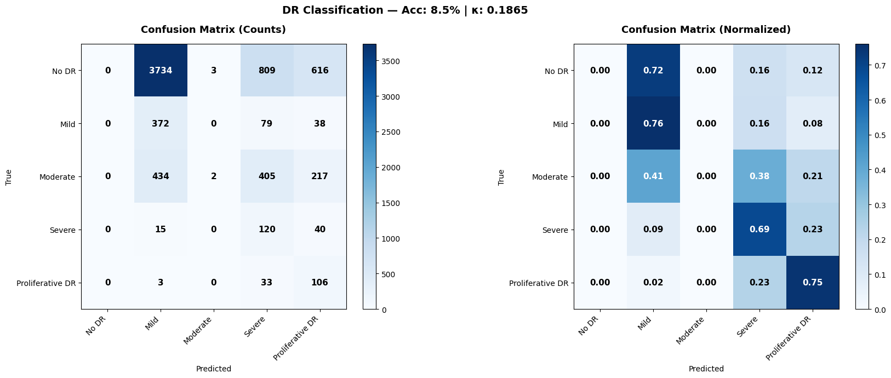

# 🔬 Diabetic Retinopathy Detection using EfficientNet-B4

A deep learning pipeline for automated detection and classification of **Diabetic Retinopathy (DR)** from retinal fundus images using the EyePACS dataset.

---

## Overview

This project implements an end-to-end pipeline for DR detection, including:

- Dataset handling (EyePACS)
- Advanced **13-stage preprocessing pipeline**
- Training using **EfficientNet-B4**
- Handling class imbalance (Weighted Sampling + Class Weights)
- Evaluation using:
  - Accuracy
  - Confusion Matrix
  - Quadratic Weighted Kappa (QWK)

---
## 🔬 Preprocessing Pipeline (13 Stages)


1. Load image (RGB)  
2. Crop black borders  
3. Retina centering  
4. Circular masking  
5. Glare removal (inpainting)  
6. Ben Graham preprocessing  
7. CLAHE contrast enhancement  
8. Green channel enhancement  
9. Vessel enhancement (Frangi filter)  
10. Red channel enhancement  
11. Adaptive denoising  
12. Resize (380×380)  
13. Normalization (ImageNet stats)  

---

## 📊 Dataset

### Class Imbalance


- **Dataset**: EyePACS (Kaggle Diabetic Retinopathy Detection)
- **Total Images**: 35,126
- **Classes (5 levels)**:
  - 0 → No DR
  - 1 → Mild
  - 2 → Moderate
  - 3 → Severe
  - 4 → Proliferative DR

| Grade | Count | Percentage |
|------|------|-----------|
| 0 | 25,810 | 73.5% |
| 1 | 2,443 | 7.0% |
| 2 | 5,292 | 15.1% |
| 3 | 873 | 2.5% |
| 4 | 708 | 2.0% |

---

## 🧠 Model Architecture

- **Base Model**: EfficientNet-B4 (ImageNet pretrained)
- **Custom Head**:
  - Linear (in_features → 512)
  - BatchNorm + ReLU
  - Dropout (0.3)
  - Output layer (5 classes)

---


## ⚙️ Training Strategy

### Phase 1 (Transfer Learning)
- Backbone: Frozen  
- Loss: Weighted CrossEntropy + Label Smoothing  
- Optimizer: AdamW  
- LR Scheduler: Warmup + Cosine Decay  
- Mixed Precision Training (AMP)  

### Phase 2 (Fine-Tuning)
- Backbone: Unfrozen  
- Loss: Focal Loss (γ = 2.0)  
- Lower learning rate  
- Metric: Quadratic Weighted Kappa  

---

## 📈 Results



### Validation Performance
- **Accuracy**: 8.5%  
- **Quadratic Kappa**: 0.1865  

### Observations
- Model struggles due to:
  - Severe class imbalance  
  - Over-prediction of minority classes  
  - Poor performance on "No DR" class  

---

## 🧪 Evaluation Metrics

- Accuracy  
- Precision / Recall / F1-score  
- Confusion Matrix  
- Quadratic Weighted Kappa (QWK)  

---

## 📁 Project Structure

```

.
├── images/
│   ├── Dataset distribution.png
│   ├── retina preprocessing.png
│   └── Results.png
├── preprocessing/
├── models/
├── training/
├── outputs/
│   ├── best_model.pth
│   ├── final_model.pth
│   ├── confusion_matrix.png
│   ├── training_history.png
│   └── submission.csv
└── notebook.ipynb

````

---

## 🛠️ Installation

```bash
pip install torch torchvision scikit-image pandas numpy matplotlib tqdm
````

---

## ▶️ Running the Project (Kaggle)

1. Open Kaggle Notebook
2. Add dataset:

   * `resized-2015-2019-blindness-detection-images`
3. Enable GPU (P100 recommended)
4. Run all cells

---

## 📦 Output Files

* `best_model.pth` → Best validation model
* `final_model.pth` → Final trained model
* `submission.csv` → Kaggle submission
* `training_history.png`
* `confusion_matrix.png`

---

## 🔍 Inference

```python
grade, probs = predict_single_image("image.jpeg")
```

---

## ⚠️ Limitations

* Heavy class imbalance affects learning
* Low validation accuracy
* Overfitting tendencies
* High preprocessing cost

---

## 💡 Future Improvements

* Use **Ordinal Regression (instead of classification)**
* Apply **Label Distribution Learning**
* Try **Vision Transformers (ViT)**
* Use **Ensemble models**
* Improve augmentation (CutMix, MixUp)
* Better loss functions (QWK Loss)

---

## 🧑‍💻 Author

**Nirlesh Saravanan**
Computer Science & Engineering
Machine Learning | Computer Vision | Healthcare AI

---

## 📜 License

This project is for academic and research purposes.

